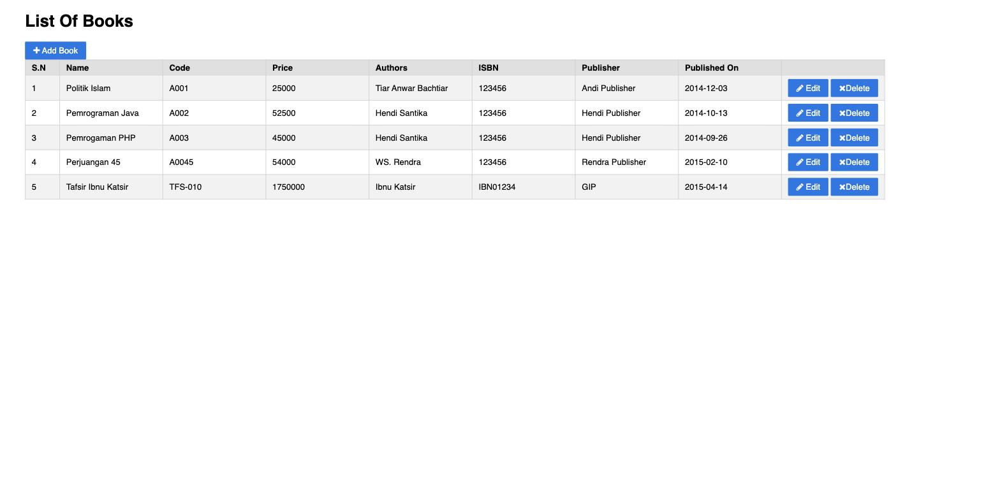

bookstore
=========

[](https://github.com/hendisantika/bookstore/actions/workflows/maven.yml)

A complete example for Spring MVC + Maven + Hibernate CRUD operation.

Hendi Santika

https://github.com/hendisantika

## Tech Stack

- Java 25
- Spring Framework 7 (MVC, ORM)
- Hibernate 7 (Jakarta Persistence)
- MySQL 8
- Jakarta Servlet / JSP / JSTL

## Running locally

1. Create the `bookstore` database and load the schema:
   ```
   mysql -u root -p -e "CREATE DATABASE IF NOT EXISTS bookstore;"
   mysql -u root -p bookstore < bookstore.sql
   ```
2. Update `src/main/resources/database.properties` with your MySQL credentials if needed.
3. Run the app:
   ```
   mvn jetty:run
   ```

Context Path : http://localhost:8080/bookstore/book/

Database: bookstore

## Screenshot


